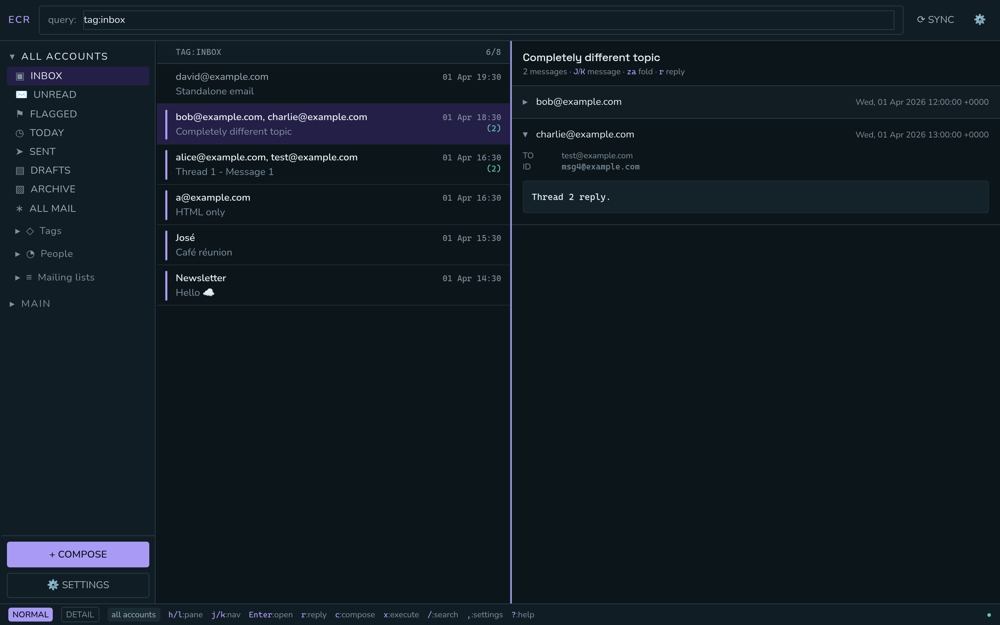
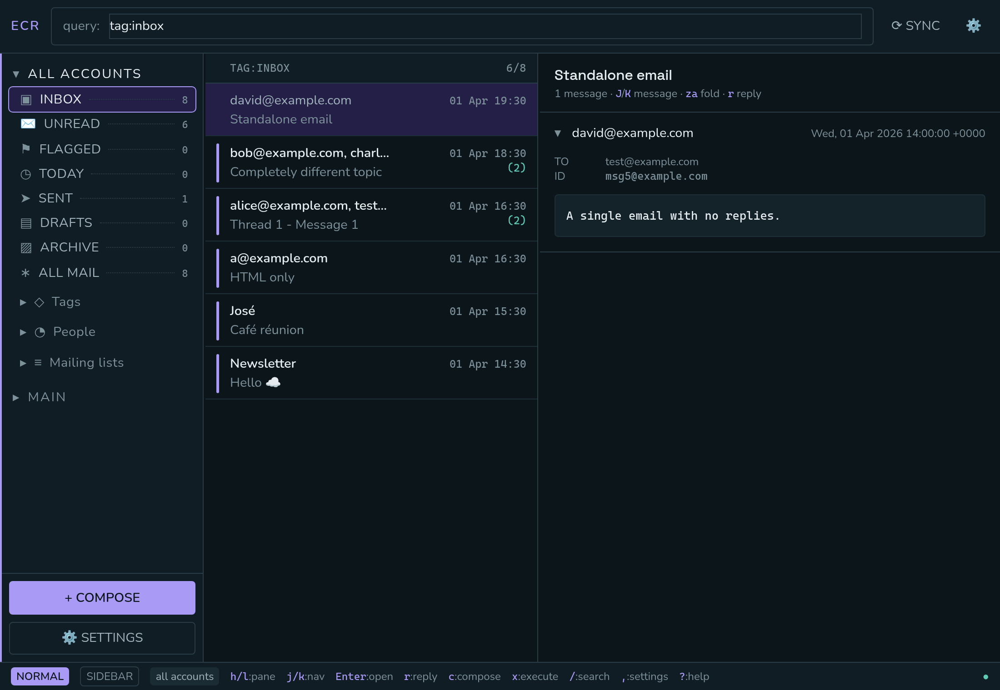
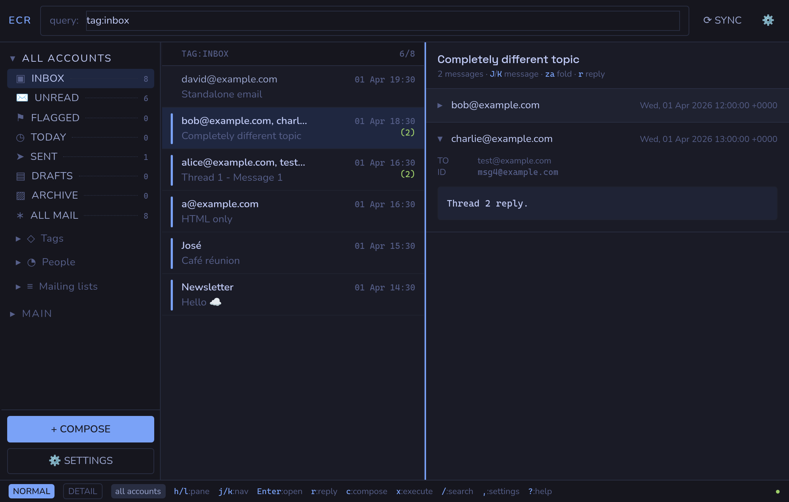
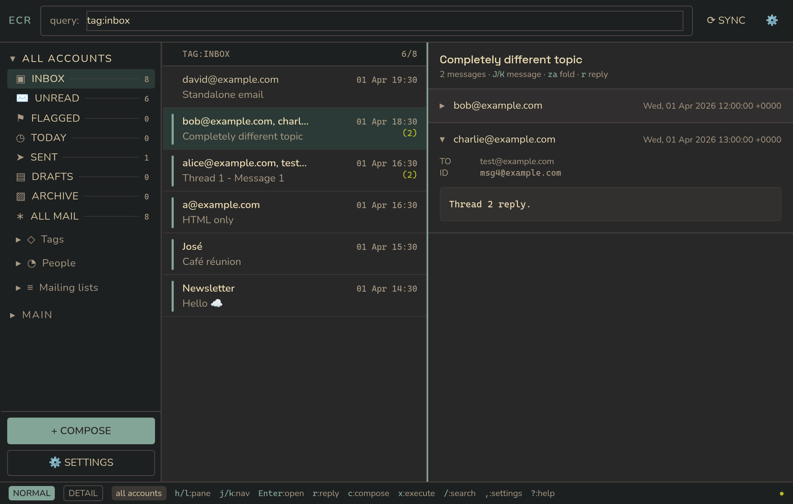
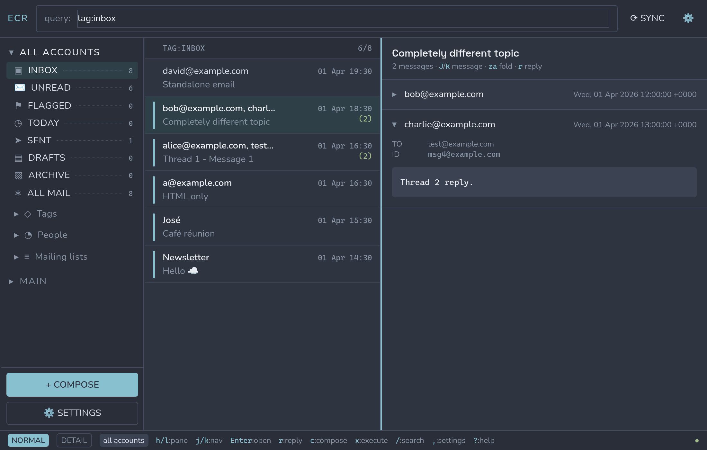
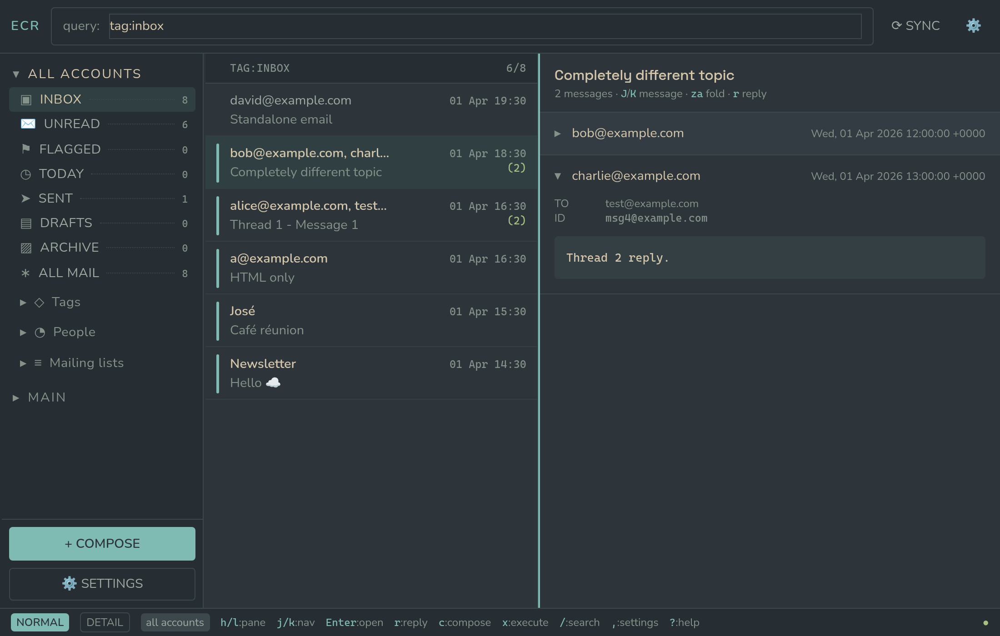
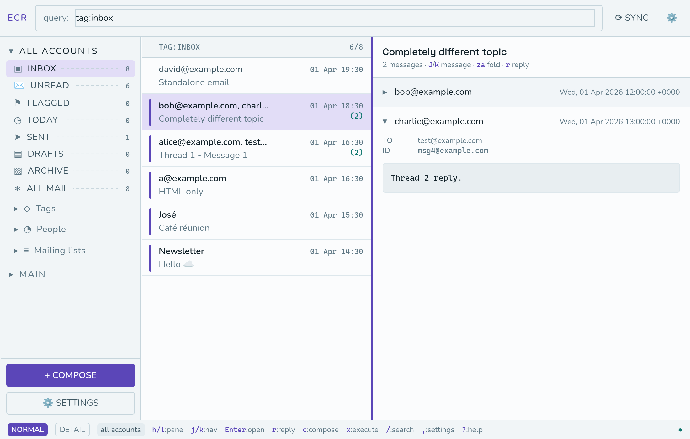
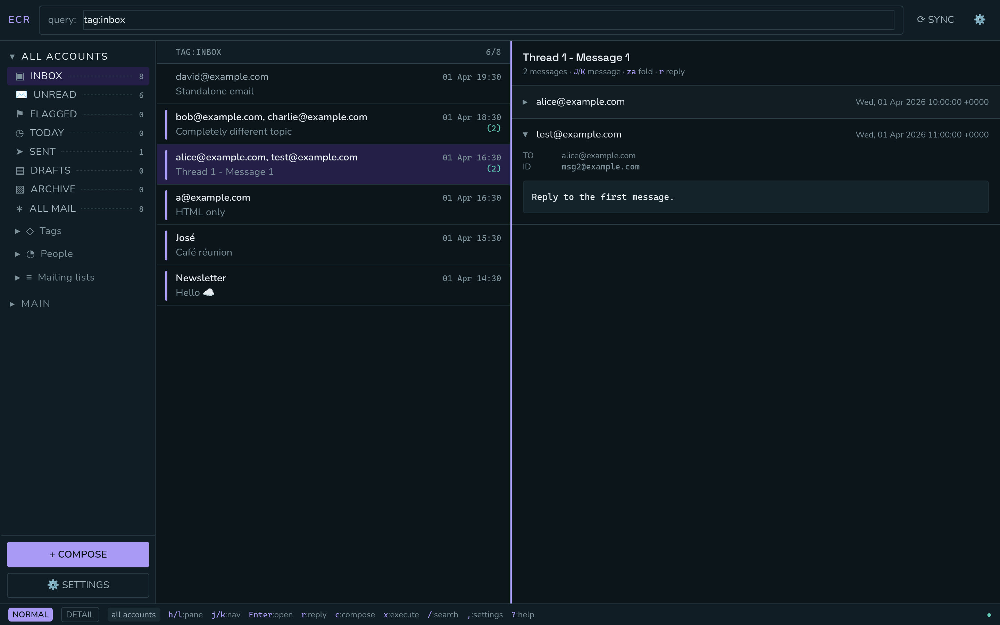
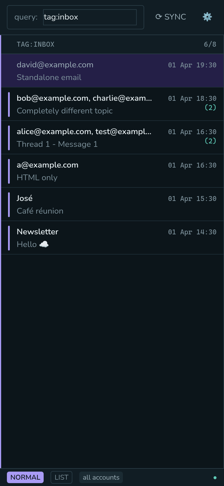

# ECR (Email Client in Rust)

[](https://github.com/lokeshmohanty/ecr/actions/workflows/ci.yml)
[](#licence)
[](https://github.com/lokeshmohanty/ecr/releases)

**E**mail **C**lient in **R**ust. A keyboard-driven mail client for an existing
[notmuch](https://notmuchmail.org/) maildir. A Rust server owns all the mail state; one SolidJS UI ships to the
browser, the desktop and Android.



```
Browser ─┐
Desktop ─┼─ HTTP/JSON + SSE ─→ ecr-server ─→ ecr-store ─→ notmuch / mbsync / msmtp
Android ─┘   bearer token                        │             maildir
                                           revision (lastmod)
```

`ecr` does not fetch, store or index mail itself. It reads the maildir notmuch
already indexes, and shells out to `mbsync` and `msmtp` for the parts those tools
already do well. If you have a working notmuch setup, `ecr` is a UI for it. If
you do not, `ecr` is not the place to start.

## Why

Terminal mail clients are fast and unreadable — HTML mail is most mail, and a
pager cannot render it. Graphical clients render it and are slow to drive. `ecr`
puts a real browser engine behind vim keys: `j`/`k` through threads, `Enter` into
a message, `r` to reply, and the same motions, visual mode and `/` search *over
the rendered message* as over any other buffer.

One consequence worth stating plainly: the server needs `notmuch`, `mbsync` and
`msmtp` on `PATH`, so it runs on a machine, not on a phone. Mobile clients talk
to a server you run, over a tailnet. There is no cloud component and
nothing to sign up for.

## Install

Every artifact below is built by CI and attached to the
[latest release](https://github.com/lokeshmohanty/ecr/releases/latest).

### Nix / NixOS / Home Manager

Two channels are published, and they differ only in which commit you get:

| Channel | Flake ref |
|---|---|
| newest release | `github:lokeshmohanty/ecr/release` |
| `main` | `github:lokeshmohanty/ecr` |

CI fast-forwards the `release` branch to each tag once its artifacts have built,
so the stable channel needs no edit per release — `nix flake update ecr` moves
it. Both stamp the git revision into the version, so `ecr --version` always says
which one is installed.

```bash
nix run github:lokeshmohanty/ecr             # try main
nix profile install github:lokeshmohanty/ecr/release   # keep the newest release
```

With Home Manager, which is the route that tracks a channel properly:

```nix
{
  inputs.ecr.url = "github:lokeshmohanty/ecr";   # or .../release
  # ...
  imports = [ inputs.ecr.homeManagerModules.default ];

  programs.ecr = {
    enable = true;
    desktop = true;                # also install the Tauri client
    server.enable = true;          # `ecr serve` as a systemd user service
    server.bind = "127.0.0.1:8383";
  };
}
```

A user service rather than a system one because the maildir, the notmuch
database and every config `ecr` reads live in `$HOME`. For a machine that should
serve mail with nobody logged in, the NixOS module is still there:

```nix
{
  imports = [ inputs.ecr.nixosModules.default ];
  services.ecr = {
    enable = true;
    user = "you";
    bind = "127.0.0.1:8383";
  };
}
```

`flake.nix` advertises `lokeshmohanty.cachix.org`, which CI populates on every
push to `main`; without it, tracking main means compiling the server and the
client on every update. Full detail in [docs/content/installing.md](docs/content/installing.md).

### Debian / Ubuntu

```bash
curl -LO https://github.com/lokeshmohanty/ecr/releases/latest/download/ecr_amd64.deb
sudo apt install ./ecr_amd64.deb
```

### Any Linux

```bash
curl -L https://github.com/lokeshmohanty/ecr/releases/latest/download/ecr-x86_64-unknown-linux-gnu.tar.gz | tar xz
cd ecr-x86_64-unknown-linux-gnu
./bin/ecr doctor
```

Besides the binary and the web client, the tarball carries a man page, bash/zsh/
fish completions, and a systemd **user** unit — nothing starts the server for
you otherwise:

```bash
install -Dm755 bin/ecr ~/.local/bin/ecr
install -Dm644 share/systemd/user/ecr.service ~/.config/systemd/user/ecr.service
systemctl --user daemon-reload && systemctl --user enable --now ecr
```

An AppImage of the desktop client is attached to the same release. Note that the
`.deb` and the AppImage carry the *desktop client*, not the server.

### From source

```bash
cargo install ecr-cli          # the server and CLI
```

`cargo install` builds the `ecr` binary only; the web UI it serves is bundled in
the release artifacts, not on crates.io. Build it with `just build` from a clone.

### Android

Sideload the APK from the release page. It is a client — point it at a server
you run, over a tailnet. See
[docs/content/operations.md](docs/content/operations.md#android).

The store page lives in [`metadata/`](metadata/) and the F-Droid build recipe in
[`packaging/fdroid/`](packaging/fdroid/); F-Droid builds and signs from source
itself, so that APK and the one on the release page have different signatures
and cannot replace each other in place. [PRIVACY.md](PRIVACY.md) is the policy —
short, because the app talks to nothing but your own server.

## Quick start

```bash
ecr doctor    # explains your mail setup; the server refuses to start unless healthy
ecr serve     # http://127.0.0.1:8383 — UI and API on one origin
```

`doctor` is the gate. It resolves every config file, reports which one it chose
and why, and refuses to let the server start if the setup cannot work.

From a clone, with [Nix](https://nixos.org) and [direnv](https://direnv.net):

```bash
direnv allow          # or: nix develop
just install
just run              # builds the client, starts the server, opens a browser
```

Reaching it from a phone:

```bash
ecr token new phone --qr                  # prints a pairing QR
ECR_BIND=<tailnet-addr>:8383 ecr serve
```

## Keys

Three panes — sidebar, list, detail — with `h`/`l` moving focus.

| | |
|---|---|
| `j` `k` | move in the focused pane |
| `Enter` | open a thread; in the detail pane, enter view mode |
| `r` `c` | reply, compose |
| `Space` `v` `V` | select a row, draw a range |
| `d` `a` `u` `f` `t` | stage delete / archive / unread / flag / any tag |
| `x` `X` | write staged tags, or clear them |
| `/` `:` `?` | search, command palette, help |

Reading has a cursor of its own: `Enter` in the detail pane gives you the
ordinary motions, visual mode, `/` and `y` over the rendered message, HTML or
plain text alike. Nothing runs inside the message frame — the sandbox never
grants `allow-scripts`.

## The sidebar

Mailboxes, then whatever the database can tell you about itself: the tags in
use and the mailing lists you are on. Counts come
from one `notmuch count --batch` for the rows actually on screen.



Every part of it is optional — icons, the dotted leaders, the counts, which
sections appear and in what order — and you can add rows of your own:

```toml
[sidebar]
sidebar_icons = true
sidebar_leaders = true
sidebar_counts = true
sidebar_sections = ["mailboxes", "tags", "lists", "queries"]
sidebar_custom = [{ name = "Patches", query = "subject:PATCH", icon = "◆" }]
```

Mailing lists need `index.header.List=List-Id` in your notmuch config and a
`notmuch reindex '*'`; without it `List:` is not searchable and ecr says so
rather than showing rows that match nothing. `ecr doctor` checks for it.

## Themes

The palette is a TOML file, linked from `settings.toml`:

```toml
[appearance]
theme = "themes/tokyonight.toml"
```

Ten presets are written into `~/.config/ecr/themes/` on first run — copy one,
edit it, and point `theme` at your copy. Editing a preset in place works too;
ecr never overwrites a file you have changed.

| | |
|---|---|
|  |  |
| Tokyo Night | Gruvbox Dark |
|  |  |
| Nord | Everforest |
|  |  |
| ecr Light | Reading, in ecr Dark |

A theme names roles rather than widgets — `paper`, `ink`, `rule`, and three
accents that carry meaning — so changing one changes everything that means that
thing:

```toml
name = "Tokyo Night"
color_scheme = "dark"

[colors]
paper = "#1a1b26"       # app background
ink = "#c0caf5"         # primary text
obligation = "#7aa2f7"  # unread, focus, the accent
blocking = "#f7768e"    # staged writes, destructive actions
```

## On a phone



## Documentation

Published at **<https://www.lokeshmohanty.in/ecr>**, built from the same
files an agent reads out of `docs/content/`:

- [docs/content/_index.md](docs/content/_index.md) — start here
- [docs/content/architecture.md](docs/content/architecture.md) — crates, data flow, why the pieces are shaped this way
- [docs/content/api.md](docs/content/api.md) — the HTTP surface
- [docs/content/installing.md](docs/content/installing.md) — the two channels, Home Manager, NixOS
- [docs/content/operations.md](docs/content/operations.md) — running the server, tokens, doctor, troubleshooting
- [docs/content/development.md](docs/content/development.md) — building, testing, verifying
- [docs/content/releasing.md](docs/content/releasing.md) — how a release is cut
- [CONTRIBUTING.md](CONTRIBUTING.md) — how to work on it
- [SECURITY.md](SECURITY.md) — reporting a vulnerability

## Roadmap

Releases are marked here. A box ticks when the work is on `main` **and** covered
by a test that runs in CI.

### v0.1.1 — first public release &nbsp;·&nbsp; `[x]` released 2026-08-03

The client is complete for daily reading and writing. This release is about
making it installable by someone other than me.

- [x] Search, threading, MIME rendering, tagging, sync and send
- [x] REST + SSE server, bearer auth, maildir watcher
- [x] Web client: read, search, tag, mark queue, compose, mobile layout
- [x] Vim editing throughout — composer, settings file, and the message being read
- [x] Desktop shell (Tauri, Linux)
- [x] Licence, third-party notices and a dependency gate in CI
- [x] Release artifacts: tarball, `.deb`, AppImage, APK, AAB, Nix flake outputs
- [ ] `ecr init` — a first-run path that does not assume an existing notmuch setup
- [ ] Installed and run on a machine that is not mine

### v0.2.0 — mobile and speed &nbsp;·&nbsp; `[ ]`

- [x] Android client shipped as an APK, built in CI
- [ ] SQLite cache in `ecr-store` — every request currently shells out to notmuch (~200ms for a 50-thread page of a 23k inbox), which is too slow for search-as-you-type
- [ ] `ts-rs` type generation, so `web/src/api/types.ts` cannot drift from `ecr-core`
- [ ] Remaining `ecr` subcommands: `web`, `qr`, `oauth`, `logs`, and the background lifecycle

### v1.0.0 — stable &nbsp;·&nbsp; `[ ]`

- [ ] Frozen HTTP API, versioned and documented
- [ ] Settings file format stable across upgrades
- [ ] macOS desktop build
- [ ] Notmuch database access without a subprocess per request

### Not planned

Fetching mail directly — `mbsync` does that. An address book, calendaring, PGP,
and any hosted component. I am not building an iOS client: it needs a paid
Apple developer account to put on anyone's phone, and I do not have one.

## Status

| Piece | State |
|---|---|
| `ecr-core`, `ecr-store` | complete: search, threading, MIME, tagging, sync, send |
| `ecr-server` | complete: REST, SSE, bearer auth, maildir watcher |
| `ecr-cli` (`ecr`) | `doctor`, `serve`, `token` and `help`; `init`, `web`, `qr`, `oauth` and the background lifecycle are declared but not implemented |
| `web` | complete: read, search, tag, mark queue, compose, mobile layout |
| `shell` (Tauri desktop) | builds and runs on Linux; packaged as deb, AppImage and a Nix derivation, with a desktop entry, icons and AppStream metadata |
| Android | builds and runs; APK and AAB per release, own launcher icon, cleartext to a self-hosted server, registers as a `mailto:` handler |
| SQLite cache | not built |

## Contributing

Issues and pull requests are welcome. [CONTRIBUTING.md](CONTRIBUTING.md) covers
the environment, what CI will check, and the conventions this codebase actually
follows. Short version:

```bash
just check    # fmt, lint, both test suites, browser, visual and UX verification
```

## Credits

`ecr` is a user interface over other people's work, and most of what makes it
useful was written elsewhere.

**The tools it drives.** These are separate processes, not libraries — `ecr`
would have nothing to show without them:

- [notmuch](https://notmuchmail.org/) — the index, the threading and the query
  language. Every list this client shows is a notmuch query, and the tags are
  notmuch's tags. Built on [Xapian](https://xapian.org/) and
  [GMime](https://github.com/jstedfast/gmime).
- [isync / mbsync](https://isync.sourceforge.io/) — fetching mail into the
  maildir.
- [msmtp](https://marlam.de/msmtp/) — sending it.
- `oauthman` — XOAUTH2 for Gmail and Outlook, which both mbsync and msmtp shell
  out to.

**Prior art.** The interaction model is not new, and is not pretending to be:

- [mutt](http://www.mutt.org/) and [neomutt](https://neomutt.org/) — the
  keyboard-first mail client everything here is measured against. `ecr` exists
  because that model deserved a real rendering engine, not because it needed
  replacing.
- [aerc](https://aerc-mail.org/), [alot](https://github.com/pazz/alot) and
  [astroid](https://github.com/astroidmail/astroid) — the notmuch-native clients
  that showed what a query-driven mailbox feels like.
- [vim](https://www.vim.org/) and [neovim](https://neovim.io/) — the motions,
  the operators and the modes. `web/src/keymap/` is an homage, and any place it
  diverges is a place it fell short.

**Built with.** [Rust](https://www.rust-lang.org/),
[axum](https://github.com/tokio-rs/axum) and [tokio](https://tokio.rs/) on the
server; [SolidJS](https://www.solidjs.com/), [Tailwind
CSS](https://tailwindcss.com/) and [Vite](https://vite.dev/) in the client;
[Tauri](https://tauri.app/) for the desktop and Android shells;
[ammonia](https://github.com/rust-ammonia/ammonia) for sanitising message HTML;
[Playwright](https://playwright.dev/) for the tests that run in a real browser;
and [Nix](https://nixos.org/) for the fact that any of it builds twice the same
way. The three bundled webfonts — Space Grotesk, Nunito and Cascadia Code — are
OFL-1.1; see [THIRD-PARTY.md](THIRD-PARTY.md) for every dependency and what its
licence obliges.

**Written with AI assistance.** Much of this codebase was written in
collaboration with coding agents, and it seems dishonest not to say so:
[Claude](https://claude.com/) (largely through
[Claude Code](https://claude.com/claude-code)), `pi` running GLM-5.2, and
Antigravity. The design decisions, the traps
recorded in [AGENTS.md](AGENTS.md) and the review of every line remain mine.

## Licence

MIT — see [LICENSE](LICENSE).

ecr drives `notmuch`, `mbsync` and `msmtp` as separate processes and does not
link them, so their GPL terms do not extend to this project. The bundled
webfonts are OFL-1.1. [THIRD-PARTY.md](THIRD-PARTY.md) records every
dependency's licence and what each obliges.

Contributions are MIT, on the same terms. There is no CLA.
